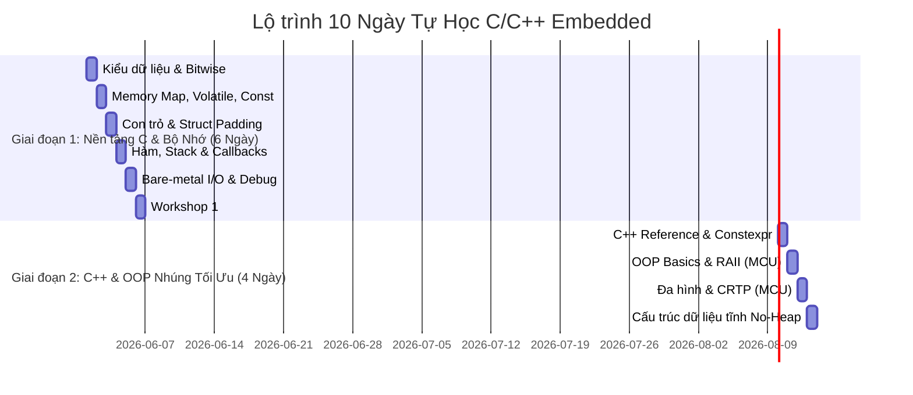

# CHƯƠNG TRÌNH TỰ HỌC CỐT LÕI C/C++ CHO LẬP TRÌNH NHÚNG (FAST-TRACK 10 NGÀY)
> **Định hướng:** Tập trung sâu vào nền tảng C (Memory/Hardware) và C++ Hướng đối tượng tối ưu (Zero-overhead OOP).
> **Điều chỉnh:** Rút gọn thời lượng học chính khóa còn **10 ngày**. Các chương nâng cao từ Chương 10 đến Chương 13 được chuyển thành phần **Kiến thức tham khảo tự học nâng cao**.

---

## 📌 LỘ TRÌNH TỔNG QUAN 10 NGÀY

---

## 🗓️ CHI TIẾT LỘ TRÌNH HỌC TỪNG NGÀY

### GIAI ĐOẠN 1: NỀN TẢNG C & QUẢN TRỊ BỘ NHỚ VẬT LÝ (Core C & Bare-Metal Memory)
*Mục tiêu: Làm chủ bản chất vật lý của biến, hàm, con trỏ và cách tối ưu hóa RAM/Flash trên vi điều khiển.*

#### 🔴 Ngày 1: Kiểu Dữ Liệu Cố Định & Thao Tác Bitwise
*   **Nội dung cốt lõi:**
    *   Bắt buộc sử dụng kiểu dữ liệu độ rộng cố định `<stdint.h>` (`uint8_t`, `int32_t`,...) thay cho kiểu nguyên bản (`int`, `long`).
    *   Hiểu và phòng ngừa hành vi **Integer Promotion** (Ép kiểu ngầm định của compiler).
    *   Thao tác Bitwise: Set, Clear, Toggle, Check trạng thái thanh ghi bằng bitmask.
    *   Khái niệm về **Endianness** (Little-Endian vs Big-Endian) khi truyền dữ liệu cảm biến.
*   **Học liệu cục bộ:**
    *   Lý thuyết: [01_Variables_DataTypes/material.md](file:///d:/Workspaces/C_CPP/C_CPP_BASIC_EMB/01_Variables_DataTypes/material.md)
    *   Code ví dụ: [01_Variables_DataTypes/example.md](file:///d:/Workspaces/C_CPP/C_CPP_BASIC_EMB/01_Variables_DataTypes/example.md)
*   **Bài tập:** [assignments_10days_embedded.md - Ngày 1](file:///d:/Workspaces/C_CPP/C_CPP_BASIC_EMB/assignments_10days_embedded.md)

#### 🔴 Ngày 2: Volatile, Const & Bản Đồ Bộ Nhớ MCU (Memory Map)
*   **Nội dung cốt lõi:**
    *   Hiểu 4 giai đoạn biên dịch và cách định vị dữ liệu vật lý trên RAM/Flash: `.text` (Mã máy), `.rodata` (Hằng số), `.data` (Biến toàn cục có khởi tạo), `.bss` (Biến toàn cục zero-init), `Stack` (Biến cục bộ).
    *   Từ khóa `volatile`: Ngăn compiler tối ưu hóa thanh ghi/biến dùng chung với ngắt (ISR), chống lỗi Heisenbugs.
    *   Từ khóa `const` vật lý: Ép biến lưu hoàn toàn vào Flash ROM để tiết kiệm dung lượng RAM.
*   **Học liệu cục bộ:**
    *   Lý thuyết: [02_MemoryLayout_Compile/material.md](file:///d:/Workspaces/C_CPP/C_CPP_BASIC_EMB/02_MemoryLayout_Compile/material.md)
    *   Sổ tay nâng cao: [ADVANCED_MCU_ECU_KNOWLEDGE.md Mục 7 & 11](file:///d:/Workspaces/C_CPP/C_CPP_BASIC_EMB/ADVANCED_MCU_ECU_KNOWLEDGE.md)
*   **Bài tập:** [assignments_10days_embedded.md - Ngày 2](file:///d:/Workspaces/C_CPP/C_CPP_BASIC_EMB/assignments_10days_embedded.md)

#### 🔴 Ngày 3: Con Trỏ & Căn Lề Dữ Liệu (Struct Padding & Alignment)
*   **Nội dung cốt lõi:**
    *   Bản chất của con trỏ (Pointer) dưới góc nhìn địa chỉ vật lý RAM. Pointer Decay trong mảng.
    *   Strict Aliasing Rule và hiểm họa ép kiểu con trỏ tùy tiện làm sập chip (Hardware Alignment Faults).
    *   Struct Padding & Alignment: Cách compiler tự chèn byte trống để căn lề 32-bit.
    *   Sử dụng `#pragma pack(push, 1)` để đóng gói gói tin siêu nén (0-padding).
*   **Học liệu cục bộ:**
    *   Lý thuyết: [03_Arrays_Pointers_Reference/material.md](file:///d:/Workspaces/C_CPP/C_CPP_BASIC_EMB/03_Arrays_Pointers_Reference/material.md)
*   **Bài tập:** [assignments_10days_embedded.md - Ngày 3](file:///d:/Workspaces/C_CPP/C_CPP_BASIC_EMB/assignments_10days_embedded.md)

#### 🔴 Ngày 4: Quản Lý Hàm, Stack Frame & Tính Không Tái Nhập (Reentrancy)
*   **Nội dung cốt lõi:**
    *   Bản chất của lời gọi hàm: Stack Frame được tạo ra thế nào? Quy tắc truyền tham số qua thanh ghi (ARM ABI rules).
    *   Hiểu rủi ro tràn ngăn xếp (Stack Overflow) và nguyên nhân cấm tuyệt đối đệ quy (**Recursion Banned**) theo MISRA.
    *   Hàm tái nhập (**Reentrant Function**) vs Hàm phi tái nhập (**Non-reentrant Function**): Cách viết code an toàn với Interrupt / RTOS.
    *   Con trỏ hàm (Function Pointer) ứng dụng làm Callback điều khiển sự kiện hoặc thiết kế Task Scheduler siêu nhẹ.
*   **Học liệu cục bộ:**
    *   Lý thuyết: [04_Functions_PassingVariables/material.md](file:///d:/Workspaces/C_CPP/C_CPP_BASIC_EMB/04_Functions_PassingVariables/material.md)
    *   Sổ tay nâng cao: [ADVANCED_MCU_ECU_KNOWLEDGE.md Mục 6 & 13](file:///d:/Workspaces/C_CPP/C_CPP_BASIC_EMB/ADVANCED_MCU_ECU_KNOWLEDGE.md)
*   **Bài tập:** [assignments_10days_embedded.md - Ngày 4](file:///d:/Workspaces/C_CPP/C_CPP_BASIC_EMB/assignments_10days_embedded.md)

#### 🔴 Ngày 5: Ngoại vi Bare-metal, Chuyển Hướng Printf & Hệ Thống Debug/Assert
*   **Nội dung cốt lõi:**
    *   Các cơ chế giao tiếp cơ bản: Polling (Truy vấn vòng) vs Interrupt (Ngắt) vs DMA (Truy cập bộ nhớ trực tiếp).
    *   Retarget `printf` xuống UART để in log ra màn hình máy tính. Tránh nghẽn ngắt UART vì in log quá dài.
    *   Thiết kế cơ chế `ASSERT` tùy biến trên môi trường nhúng sản xuất (nhúng cờ dừng an toàn Failsafe, ngắt điện driver động cơ trước khi reset chip).
*   **Học liệu cục bộ:**
    *   Lý thuyết: [05_FileIO_Debugging/material.md](file:///d:/Workspaces/C_CPP/C_CPP_BASIC_EMB/05_FileIO_Debugging/material.md)
    *   Sổ tay nâng cao: [ADVANCED_MCU_ECU_KNOWLEDGE.md Mục 10](file:///d:/Workspaces/C_CPP/C_CPP_BASIC_EMB/ADVANCED_MCU_ECU_KNOWLEDGE.md)
*   **Bài tập:** [assignments_10days_embedded.md - Ngày 5](file:///d:/Workspaces/C_CPP/C_CPP_BASIC_EMB/assignments_10days_embedded.md)

#### 🔴 Ngày 6: Workshop Tích Hợp Giai Đoạn 1 - Đóng Gói Tin & Phân Tích Bộ Nhớ
*   **Nhiệm vụ:**
    1.  Đọc kỹ bối cảnh và yêu cầu kỹ thuật trong tệp [workshop1.md](file:///d:/Workspaces/C_CPP/C_CPP_BASIC_EMB/workshop1.md).
    2.  Triển khai cấu trúc dữ liệu `TelemetryPayload_t` nén (0-padding).
    3.  Lập trình hàm `Telemetry_Pack` tự chuyển đổi thứ tự Byte (Endianness) thủ công sang Big-endian để truyền không lỗi.
    4.  Giả lập cờ ngắt ADC an toàn với `volatile`.
    5.  Hoàn thành bảng phân tích bản đồ bộ nhớ (Memory Map): chỉ ra chính xác các thành phần dữ liệu trong code đang nằm ở `.text`, `.rodata`, `.data`, `.bss` hay `Stack` trên phần cứng MCU.

---

### GIAI ĐOẠN 2: CHUYỂN DỊCH C++ VÀ HƯỚNG ĐỐI TƯỢNG TỐI ƯU (Embedded C++ & Decoupled OOP)
*Mục tiêu: Sử dụng C++ đúng cách (Embedded C++), duy trì hiệu năng cao nhất (Zero-overhead OOP).*

#### 🟢 Ngày 7: Bước Dịch Chuyển C sang C++ nhúng: Reference, Namespace & Constexpr
*   **Nội dung cốt lõi:**
    *   C++ Reference (`&`) vs Con trỏ: An toàn hơn, không sợ địa chỉ `NULL`, chống dangling pointers.
    *   Namespaces: Tách biệt không gian đặt tên Driver/App, loại bỏ xung đột trùng tên hàm trong các thư viện lớn.
    *   `constexpr` & `static_assert`: Chuyển dịch tính toán từ thời kỳ chạy (Runtime) sang thời kỳ biên dịch (Compile-time). Kiểm tra cấu hình hệ thống ngay lúc build.
*   **Học liệu cục bộ:**
    *   Lý thuyết: [08_Namespace_Templates/material.md](file:///d:/Workspaces/C_CPP/C_CPP_BASIC_EMB/08_Namespace_Templates/material.md)
*   **Bài tập:** [assignments_10days_embedded.md - Ngày 7](file:///d:/Workspaces/C_CPP/C_CPP_BASIC_EMB/assignments_10days_embedded.md)

#### 🟢 Ngày 8: OOP Cơ Bản trên MCU - Đóng Gói, Vòng Đời & Nguyên Lý RAII
*   **Nội dung cốt lõi:**
    *   Tính đóng gói (Encapsulation) trong Embedded: Che giấu các thanh ghi cấu hình vật lý chỉ cho phép truy cập qua API (getters/setters).
    *   Hai giai đoạn khởi tạo (**Two-Stage Initialization**): Tách biệt hàm dựng Constructor và hàm `init()` liên quan đến xung nhịp chip.
    *   Khóa sao chép đối tượng (`= delete`): Ngăn chặn việc nhân bản vô tội vạ driver phần cứng duy nhất (Exclusive hardware drivers).
    *   Nguyên lý **RAII (Resource Acquisition Is Initialization)**: Tự động giải phóng tài nguyên. Ứng dụng viết lớp `ScopeLock` tự động bật/tắt ngắt toàn cục khi ra/vào hàm.
*   **Học liệu cục bộ:**
    *   Lý thuyết: [06_OOP_Basics/material.md](file:///d:/Workspaces/C_CPP/C_CPP_BASIC_EMB/06_OOP_Basics/material.md)
*   **Bài tập:** [assignments_10days_embedded.md - Ngày 8](file:///d:/Workspaces/C_CPP/C_CPP_BASIC_EMB/assignments_10days_embedded.md)

#### 🟢 Ngày 9: Đa Hình Trong MCU & Giải Pháp Zero-Overhead CRTP
*   **Nội dung cốt lõi:**
    *   Bản chất cấu trúc bộ nhớ và hao tổn thời gian thực thi của bảng hàm ảo (VTable & VPtr) trong đa hình động.
    *   Tắt RTTI (`-fno-rtti`) và cấm ép kiểu động (`dynamic_cast`).
    *   Thiết kế HAL cho Cảm biến (Sensor) / Động cơ (Motor) sử dụng tính năng đa hình tĩnh thời kỳ dịch: **CRTP (Curiously Recurring Template Pattern)** để có Zero-Overhead.
    *   Tư duy Ưu tiên Thành phần hơn Kế thừa (Composition over Inheritance).
*   **Học liệu cục bộ:**
    *   Lý thuyết: [07_OOP_Features/material.md](file:///d:/Workspaces/C_CPP/C_CPP_BASIC_EMB/07_OOP_Features/material.md)
*   **Bài tập:** [assignments_10days_embedded.md - Ngày 9](file:///d:/Workspaces/C_CPP/C_CPP_BASIC_EMB/assignments_10days_embedded.md)

#### 🟢 Ngày 10: Cấu Trúc Dữ Liệu An Toàn Cấm Heap (No-Heap)
*   **Nội dung cốt lõi:**
    *   Tại sao cấm hoàn toàn `std::vector` hoặc `malloc/free` trong lập trình nhúng siêu tin cậy?
    *   Xây dựng cấu trúc hàng đợi vòng tĩnh đơn luồng (**Single Producer Single Consumer (SPSC) Lock-Free Circular Buffer**) phục vụ nhận dữ liệu UART / CAN ngắt.
    *   Giải thuật lọc số đơn giản: Bộ lọc trung bình động lũy thừa (Exponential Moving Average - EMA) khử nhiễu cảm biến analog ADC.
    *   Thuật toán Tìm kiếm nhị phân (Binary Search) trên bảng hiệu chuẩn tĩnh lưu trong Flash để tra cứu nhanh.
*   **Học liệu cục bộ:**
    *   Lý thuyết: [09_DataStructures_Algorithms/material.md](file:///d:/Workspaces/C_CPP/C_CPP_BASIC_EMB/09_DataStructures_Algorithms/material.md)
*   **Bài tập:** [assignments_10days_embedded.md - Ngày 10](file:///d:/Workspaces/C_CPP/C_CPP_BASIC_EMB/assignments_10days_embedded.md)

---

## 📚 TÀI LIỆU THAM KHẢO NÂNG CAO (TỰ HỌC THÊM)
*Các chủ đề này không nằm trong chương trình học chính khóa 10 ngày nhưng rất quan trọng để bổ trợ kỹ năng nâng cao.*

1.  **Chủ đề 1: Unit Testing (C/C++) - Shift-Left in Embedded**
    *   *Nội dung:* Dependency injection, Google Mock (GMock), Unit Test trên PC không phụ thuộc board mạch thật.
    *   *Tài liệu gốc:* [10_UnitTest/](file:///d:/Workspaces/C_CPP/C_CPP_BASIC_EMB/10_UnitTest/)
2.  **Chủ đề 2: Advanced C++ Features on MCU**
    *   *Nội dung:* Move semantics (`std::move` zero-copy), cấm Exception (`-fno-exceptions`), expected/optional error, `std::atomic` cho ngắt.
    *   *Tài liệu gốc:* [11_Advanced_Cpp_Features/](file:///d:/Workspaces/C_CPP/C_CPP_BASIC_EMB/11_Advanced_Cpp_Features/)
3.  **Chủ đề 3: Optimization & Common Defects**
    *   *Nội dung:* Struct padding & alignment RAM waste, Fixed-Point PID, WDT timeout loops, linker dead-code stripping.
    *   *Tài liệu gốc:* [12_Optimization_CommonDefects/](file:///d:/Workspaces/C_CPP/C_CPP_BASIC_EMB/12_Optimization_CommonDefects/)
4.  **Chủ đề 4: Design Patterns for MCU**
    *   *Nội dung:* HAL Strategy, Observer callback, Command Queue, Active Object pattern.
    *   *Tài liệu gốc:* [13_DesignPatterns/](file:///d:/Workspaces/C_CPP/C_CPP_BASIC_EMB/13_DesignPatterns/)
